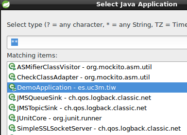

# Lab7. SpringBoot

> SpringBoot <sup id="a1">[1](#f1)</sup> is a tool of the SpringFramework family <sup id="a2">[2](#f2)</sup> that speed up development by reducing the complexity of  settings and amount of code needed to link all the modules required for the development of an application.
> 
> SpringBoot has been designed to make monolithic applications or as microservices, making the development of REST services very easy.
> 
> In this lab we will build a "spring style" application using the modules for the development complete web/REST application with the  within JPA persistence. To do this we will use the following modules:

> - SpringMVC <sup id="a3">[3](#f3)</sup>
> - SpringData <sup id="a4">[4](#f4)</sup>
> - SpringREST <sup id="a5">[5](#f5)</sup>
> - SpringHATEOAS <sup id="a6">[6](#f6)</sup>

## INDEX

<!-- MarkdownTOC  depth=3 -->

- [Exercise 1. Project setup](#exercise-1-project-setup)
    - [Execute the application](#execute-the-application)
- [Exercise 2. Web part](#exercise-2-web-part)
    - [What has happened?](#what-has-happened)
    - [Transform in a WAR](#transform-in-a-war)
- [Exercise 3. Parameters](#exercise-3-parameters)
    - [What has happened?](#what-has-happened-1)
- [Exercise 4. Views](#exercise-4-views)
    - [What has happened?](#what-has-happened-2)
- [Exercise 5. JSPs](#exercise-5-jsps)
- [Exercise 6. REST](#exercise-6-rest)
    - [What has happened?](#what-has-happened-3)
- [Exercise 7. RESTController](#exercise-7-restcontroller)
- [Exercise 8. XML](#exercise-8-xml)
- [Exercise 9. JPA](#exercise-9-jpa)
    - [What has happened?](#what-has-happened-4)
    - [Some Questions](#some-questions)
- [Exercise 10. Data REST](#exercise-10-data-rest)
- [Exercise 11. HATEOAS](#exercise-11-hateoas)
    - [What has happened?](#what-has-happened-5)
- [References](#references)

<!-- /MarkdownTOC -->

## Exercise 1. Project setup

> To create the project you can use __STS__ o [https://start.spring.io]() and put the dependencies:
> - Web, 
> - Thymeleaf, 
> - JDBC, 
> - JPA, 
> - HSQLDB, 
> - Actuator


1. Open STS and change the perspective __Spring__. 
2. Create the project with __File->New->Spring Starter Project__
3. 
4. Press  __Finish__
5. Wait unilt all dependencies have been downloaded and the project is built (you can see the state activating the maven's console) 

> Once is finalized open the __pom.xml__ file

- Inside the pom.xml file you will find a section with the following code
```xml
        <dependency>
            <groupId>org.springframework.boot</groupId>
            <artifactId>spring-boot-starter</artifactId>
        </dependency>

        <dependency>
            <groupId>org.springframework.boot</groupId>
            <artifactId>spring-boot-starter-test</artifactId>
            <scope>test</scope>
        </dependency>
```

> This two dependencies allow to import every necessary library to configure the project, for developing as much as testing. 
> 
> If you move to __Dependency Hierarchy__ tab you will see the list of libraries that have been downloaded and are necessary to work in a project like:
> - Spring-core: is the base library of springframework
> - slf4j: allow to write logs
> - mockito: library to create stubs and mock for unit testing
> 
> Everything is configured with their respective versions 

- Open `es.uc3m.tiw.DemoApplication` class and observe the code.

```java
@SpringBootApplication
public class DemoApplication {

    public static void main(String[] args) {
        SpringApplication.run(DemoApplication.class, args);
    }
}
```

- This class is the one that allow to launch the application independently without the application server 
    - The annotation `@SpringBootApplication` configure every parameter necessary to work.
    - Inside the `main()` method `SpringApplication.run` execute the configuration class, in this example it is `DemoApplication` class itself although  we don't have a custom configuration, something that we can modify.
    - This way we can execute the class as if it was a normal class and it will open tomcat embedded with the application inside.
        - If we wanted to deploy the application in our own server we should modify the pom.xml file so that instead of the jar file it will be the war the file created and change the code of this class as we shall see.

### Execute the application

1. Select the project and the right button __Run As->Spring Boot App__
    2. 
2. __Opcional:__ If you don't have STS and you work with eclipse you can choose __Run As->Java Application__
    3. Eclipse will show a list of executable classes that have the _main_ method, select the `DemoApplication` class and go
    4. 

## Exercise 2. Web part

> In this exercise we are going to configure dependencies to convert the project in a web project to be able to work with the components of the control layer. 

- Modify the following code in the __pom.xml__ file

```xml
        <dependency>
            <groupId>org.springframework.boot</groupId>
            <artifactId>spring-boot-starter</artifactId>
        </dependency>
```

- By this one:

```xml
        <dependency>
            <groupId>org.springframework.boot</groupId>
            <artifactId>spring-boot-starter-web</artifactId>
        </dependency>
```

- Save the changes.
- Create a new class (regular class, not a serlvet) `es.uc3m.tiw.controllers.MyFirstController`  
- Note down the class with the `@Controller` anotation (you have to import it). This identify the class as a web component for Springframework
- Create a `String greet()` method that return a String.
- Note down the method with the `@RequestMapping("/greet")` annotation. This anotation will define the access URL
- Note down the return type as `@ResponseBody`. This annotation will define the response body
- The class shoud be like this:

```java
    @Controller
    public class MyFirstController {

        @RequestMapping("/greet")
        public @ResponseBody String greet(){
            return "Hi";
        }
    }
```

- Execute the application and launch the web browser to the address: [http://localhost:8080/greet]()
    - You will recibe the message _Hi_ in the screen.

### What has happened

1. When you note down a class as `@Controller` automatically stop being a regular class to convert in a web controller that is able to receive objects `request` and `response`
2. SpringBoot scans all the classpath searching noted class and load them directly.
3. `@RequestMapping` define the input URL, as well as every parameters and atributes asociated to the `HttpServletRequest` object
4. `@ResponseBody` allow to modify the `HttpServletResponse` object in this case the return`String` type it is converted in the response body therefore the _"Hi"_ string will be transmitted implicitly with the _text/plain_ header
5. When the application is started, SpringBoot generate every artifact so that the application show up with an embedded tomcat and the   _demo_ project as the default context, therefore you shouldn't go to _http://localhost:8080/demo/greet_, just   _http://localhost:8080/greet_
    6. The full URL with the context should be done in case we deployed in a external server (like Glassfish) that is able to keep many contexts.

### Transform in a WAR

> This part is optional and is shown as an example in case we wanted to use a more traditional workflow deploying in an application server.


1. Open the __pom.xml__ file and localize the following line of code `<packaging>jar</packaging>` change the value of _jar_ by _war_
2. Open `DemoApplication` class and make it inherit from `org.springframework.boot.web.support.SpringBootServletInitializer`
3. Override the `configure` method.
4. The class should remain like this:

```java
@SpringBootApplication
public class DemoApplication extends SpringBootServletInitializer{

    /**
     * Used when is a JAR
     * @param args
     */
    public static void main(String[] args) {
        SpringApplication.run(DemoApplication.class, args);
    }
    
    /**
     * Used when is a WAR
     */
    @Override
    protected SpringApplicationBuilder configure(SpringApplicationBuilder builder) {
    
        return builder.sources(DemoApplication.class);
    }
}
```

> __An error will show up__ in red in the project and the _problems_ tab will indicate that the project is not up-to-date. This is caused because we have changed the pom.xml configuration file.
> 
> To fix it just right click the project and select : __Maven->Update Project__

> __NOTE:__ Before being able to deploy in a server is necessary to eliminate the CloudFoundry configurations  <sup id="a7">[7](#f7)</sup>. To do this press right button  the project and choose: __configure->Disable as Cloud Foundry APP__

- Launch the server (can be Glassfish or Pivotal tc Server, the later is a tomcat modified)
- Deploy the application in the server. You will see the same messages in the console than before .
- Launch the web browser and go to  _http://localhost:8080/greet and it will return a 404 error page.
- Try again with the new address [http://localhost:8080/demo/greet]() and you will see the response string.

## Exercise 3. Parameters

> In this exercise we are coing to see how to recibe parameters from the client .

1. Create a new method called __parameters__ that recive two parameters, a `String` and an `int`.
2. Resolve the code in this way:

```java
    @RequestMapping("/params/{name}/{age}")
    public @ResponseBody String parameters(@PathVariable String name, @PathVariable int age){
        return "Parameters are: "+name+" & "+age;
    }
```

3. Launch the application and launch the web browser the following URL: [http://localhost:8080/params/john/22]()
4. You will recive a message similar to this: _"Parameters are john & 22"_

### What has happened

- In `@RequestMapping` it is defined the URL structure and it is indicated by braces `{variable}` that it will be a series of parameters with a variable value.
- This variable names have to coincide with the ones that the method receive
- `@PathVariable` annotation indicate to SpringBoot that parameters will be received throught their position in the URI.
    - Another option should be use a traditional `QUERY_STRING` with the  `@RequestParam` annotation
- Spring carries out automatically the conversion of the received types to the expected. For instance, _age_ it is received as a String (everything coming by HTTP is in String format) and is converted automatically in a int.
    - Spring carries out the automatically conversion if is possible. That include complex types like collections, arrays, lists, own objects, etc.
    - If is not possible to carry out the conversion, for example if is introduce age in a not numeric String, the server will return a __406 Not Acceptable Response__ error 
> You can obtain more information about passing parameters in __RequestMapping__  documentation <sup id="a12">[12](#f12)</sup>.

## Exercise 4. Views

> SpringBoot can work with JSPs and templates like Tiles <sup id="a8">[8](#f8)</sup>, Velocity <sup id="a11">[11](#f11)</sup>, Freemarker <sup id="a9">[9](#f9)</sup> or Thymeleaf <sup id="a10">[10](#f10)</sup>.
> 
> __Thymeleaf__ is a template framework which their best advantage is that it can be use without the need or running on a application server, so it is possible to obtain a vision about the graphical interface aspect without the need of incorporate data from the server.
> It uses a sintasix very similar to JSP and taglibs JSTL, consequently the leap from JSP+JSTL development is very fast.

1. Open __pom.xml__ file and add the following code inside the _dependencies_ section
2. Save the changes.
```xml
        <dependency>
            <groupId>org.springframework.boot</groupId>
            <artifactId>spring-boot-starter-thymeleaf</artifactId>
        </dependency>
```

1. Create a new _folder_ in `src/main/resources` and name it __templates__
2. Inside the folder, create a new empty file called __hello.html__
3. Write the folling code:

```html
<!DOCTYPE html>
<html>
<body>
    <p>
        Hi <span th:text="${name}">name-goes-here</span> from the Thymeleaf page
    </p>
</body>
</html>
```

> __Note the following:__ Html code is normal, but inside the `<span>` tag it has been introducing thymeleaf code that will replace the string _"name-goes-here"_ by the _name_ parameter that is sent in the _request_ in case it exists. Otherwise it will keep the String inside the _span_ tag. 

1. Modify the `greet()` method from the `MiPrimerController` to receive a _"name"_ parameter of `String` type.
2. The method should request a `org.springframework.ui.Model` Spring object where the name received will be inserted and will be forward to that "model" to the page that have the same name.
    3. The parameter inserted in the model object will be called _"name"_.
4. Take out the `@ResponseBody` annotation
5. In the `return` write the _"hi"_ String (in lowercase).
3. The code is the following:

```java
	@RequestMapping("/greet/{name}")
	public @ResponseBody String greet(Model model, @PathVariable String name){
		model.addAttribute("name", name);
		return "Hi";
	}
```

- Launch the application again and open the address: [http://localhost:8080/greet/john]() in your browser.
    - you will receive the following message: _"Hi john from from the Thymeleaf page"_

### What has happened

- If we eliminate the  `@ResponseBody` annotation SpringBoot understand that the return type, if is a String, is a view and not the reponse body like before.
- Si la respuesta es una vista, SpringBoot usará el componente `ViewResolver` que tenga configurado (puede ser JSP, Freemarker, Velocity, etc.), en este caso es __Thymeleaf__ y la configuración por defecto buscará las páginas en el directorio _templates_
- La cadena de retorno será el nombre de la página. Así si devolvemos "hola", SpringBoot devolverá la página _"templates/hola.html"_. Si devolviéramos "app/hola", SpringBoot buscaría la página _"templates/app/hola.html"_
- SpringBoot usa el patrón __MVC__ y entiende que si hay una página como vista, entonces se le puede pasar un modelo. El objeto `Model` es un objeto que automáticamente se envía a la vista especificada en el `return` y cualquier atributo que metamos allí será recibido por la página.
    - Al solicitar el objeto `Model` como atributo del método `saludos()` Spring lo inyectará automáticamente y no tenemos que preocuparnos de hacer un `new` del objeto.
    - Si hay un `Model` siempre se enviará a la vista
    - Se admiten otros objetos como modelo, como por ejemplo podemos usar un `java.util.Map`
- El atributo `name` del objeto `Model` es recibido por la página Thymeleaf con la anotación `th:text="${name}"`

> Documentación sobre tipos de retorno en SpringMVC <sup id="a13">[13](#f13)</sup>.
> 
#### Para terminar

1. Para finalizar abre la página `src/templates/hola.html` directamente con un navegador web
    2. Verás el mensaje: _"Hola el-nombre-va-aquí desde una página thymeleaf"_
3. Esto ocurre porque no se procesa la petición mediante un servidor, pero a diferencia de las página JSP no verás el código fuente del estilo `<% ... %>`.
    4. Esto permite a los diseñadores/integradores trabajar en el diseño con datos temporales que serán sustuidos por los reales y ver un aspecto más cercano al final sin tener que subirlo a un servidor para comprobar si encaja bien el diseño.


## Ejercicio 5. JSPs

> ¿Qué ocurre si quiero trabajar con JSPs como parte de la vista? En este ejercicio se muestra como hacerlo.

- Crea una estructura de directorios como la siguiente (cuidado con mayúsculas/minúsculas):

```
 src/main/webapp/
                |
                 /WEB-INF/
                         |
                          /views
```
 
 - Mueve la página `hola.html` al directorio `src/main/webapp/WEB-INF/views`
 - Renombra la página a `hola.jsp`
 - Modifica el código de la página para que ahora quede así:

```html
    <p>
        Hola ${name} desde una página JSP
    </p>
```

- Quita la dependencia de Thymeleaf del fichero __pom.xml__ que añadiste anteriormente.
- Ahora SpringBoot estará configurado por defecto a usar un `InternalResourceViewResolver` en lugar de un `ThymeleafViewResolver` y tenemos que configurar dónde debe buscar las páginas:
    - Abre el fichero `src/main/resources/application.properties`
    - Escribe el siguiente código:

```

    spring.mvc.view.prefix=/WEB-INF/views/
    spring.mvc.view.suffix=.jsp

```


- Ahora la ruta hacia las páginas será compuesta por el _prefix_+return+_suffix_, así el controlador devolverá _"hola"_ y spring buscará la página _WEB-INF/views/hola.jsp_
    - Como ves hemos modificado las vistas y su configuración pero no el controlador, que sigue devolviendo la misma cadena sin importarle quién es el `ViewResolver`

> __ADVERTENCIA:__ esta configuración de JSPs sólo funcionará sobre un servidor de aplicaciones y con un fichero .war, pero no funcionará con un tomcat embebido y un fichero .jar. Tal y como avisan en la documentación <sup id="a14">[14](#f14)</sup>.
> 
> Si vas a trabajar con JSPs y con un servidor externo como Tomcat, Glassfish, JBoss, Jetty o similar entonces es recomendable que introduzcas el siguiente código en el _pom.xml_ para que no se dupliquen las librerías de Servlets y JSPs.
> 

```xml
        <dependency>
            <groupId>org.springframework.boot</groupId>
            <artifactId>spring-boot-starter-tomcat</artifactId>
            <scope>provided</scope>
        </dependency>
```

## Ejercicio 6. REST

1. Crea dos nuevas clases `es.uc3m.tiw.dominios.Usuario` y `es.uc3m.tiw.dominios.Direccion`
    2. Propiedades Usuario:
        3. `String nombre`
        4. `int edad`
        5. `Set<Direccion> direccion`
    6. Propiedades Direccion:
        7. `String calle`
        8. `int cod_postal`
9. Completa con getters/setters y constructores
10. Abre el controlador `MiPrimerController` y crea un método `void init()` donde crearás varias direcciones y un usuario con dichas direcciones.
11. Anota el método `init()` con la anotación `@PostConstruct`. 
    12. Esta anotación permitirá que se cargue este método tras la primera invocación de SpringBoot

```java
        @Controller
        public class MiPrimerController {

            private Usuario usuario;
            
            @PostConstruct
            public void init() {
                Set<Direccion> direcciones = new HashSet<>();
                direcciones.add(new Direccion("calle uno", 1111));
                direcciones.add(new Direccion("calle dos", 2222));
                
                usuario = new Usuario("usuario1", 11, direcciones);
            }
```

- Crea un nuevo método que se llame `holaUsuario()` como el siguiente:

```java
    @RequestMapping("/usuario")
    public @ResponseBody Usuario holaUsuario(){
        return usuario;
    }
```
- Ejecuta la aplicación y lanza un navegador a la dirección: [http://localhost:8080/usuario]()
    - Obtendrás la siguiente respuesta en formato JSON:

```json
    {
      "nombre": "usuario1",
      "edad": 11,
      "direccion": [
        {
          "calle": "calle uno",
          "cod_postal": 1111
        },
        {
          "calle": "calle dos",
          "cod_postal": 2222
        }
      ]
    }
```

### What has happened

> De nuevo si Spring puede convertir algo lo hará. En este caso no devolvemos una página, ni un `String`, devolvemos un objeto `Usuario`que internamente contiene una colección de objetos `Direccion`.
> SpringBoot está configurado automáticamente para devolver este tipo de objetos como documentos JSON.
> La anotación `@ResponseBody` devuelve el objeto `Usuario` como un documento dentro del mensaje de respuesta y no como el nombre de una vista lógica.
> 

## Ejercicio 7. RESTController

> Como hemos visto podemos devolver un objeto y SpringBoot lo devolverá como un documento JSON.
> 
> Si queremos hacer controladores que exclusivamente consuman y devuelvan documentos JSON y no participen de vistas, Spring nos proporciona una anotación especial: `@RestController`

1. Cambia la anotación `@Controller` por `@RestController`
2. Elimina la anotación `@ResponseBody` del método
3. Pruébalo. De nuevo obtendrás la misma respuesta, pero los métodos anteriores que usan vistas no funcionarán.

```java
@RestController
public class MiPrimerController {

    @RequestMapping("/usuario")
    public Usuario holaUsuario(){
        return usuario;
    }
}
```
## Ejercicio 8. XML

> En este ejercicio aprenderás como devolver documentos con formato XML en lugar de JSON o ambos.
> 

1. Abre la clase `Usuario` y anótala con `@XmlRootElement`
2. Recarga la aplicación y vuelve a lanzar el navegador web.
    3. Ahora obtendrás una respuesta como XML

```xml
<usuario>
    <direccion>
        <calle>calle uno</calle>
        <cod_postal>1111</cod_postal>
    </direccion>
    <direccion>
        <calle>calle dos</calle>
        <cod_postal>2222</cod_postal>
    </direccion>
    <edad>11</edad>
    <nombre>usuario1</nombre>
</usuario>
```
> Para alternar entre  JSON y XML simplemente escribe el prefijo en la URL:
> 
> [http://localhost:8080/usuario.json]()
> [http://localhost:8080/usuario.xml]()

> Nuevamente Spring separa los controladores del modelo, hemos modificado la clase `Usuario` pero no el controller.
> 


## Ejercicio 9. JPA

1. En el fichero __pom.xml__ añade la siguiente dependencia y sava los cambios:

```xml
        <dependency>
            <groupId>org.springframework.boot</groupId>
            <artifactId>spring-boot-starter-data-jpa</artifactId>
        </dependency>
```
2. Anota los dominios como __entidades__, créales una clave primaria y establece una relación one-to-many entre `Usuario` y `Direccion`.
    1. Si necesitas repasar conocimientos, revisa los ejercicios del laboratorio2. Persistencia
3. Añade la siguiente dependencia en el __pom.xml__ para obtener una base de datos que funcionará en memoria.

```xml
        <dependency>
            <groupId>com.h2database</groupId>
            <artifactId>h2</artifactId>
        </dependency>
```

4. Crea un __Interface__ en `es.uc3m.tiw.daos.UsuarioDao` y que herede del interface `org.springframework.data.repository.CrudRepository`
5. Añade los métodos de persistencia `List<Usuario> findAll();` y `Usuario findByName(String name);`
    1. El código quedará tal que así:

```java
public interface UsuarioDao extends CrudRepository<Usuario, Long> {

    List<Usuario> findAll();
    Usuario findByNombre(String nombre);
}
```
6. Corta el método `init()` del controlador y pégalo en la clase `DemoApplication` (anotación `@PostConstruct` incluida).
7. En la clase `DemoApplication` inyecta el `UsuarioDao` con el siguiente código:

```java
    @Autowired
    private UsuarioDao dao;
```
8. Completa el método `init()` con el siguiente código para guardar al usuario en la base de datos: 

            dao.save(usuario);

9. En el controlador realiza los siguientes cambios:
    1. Inyecta el `UsuarioDao`
    2. Modifica el método para que reciba un parámetro (nombre) por URL
    3. Llama al método `findByNombre` del dao 
    4. Devuelve al usuario encontrado.
10. Guarda los cambios y relanza la aplicación
    1. Ahora verás por consola trazas de `hibernate` y de `hsqldb` creando las tablas.
11. Abre el navegador a la dirección [http://localhost:8080/usuario/usuario1]() y obtendrás en formato XML la información del usuario.

```xml
<usuario>
    <direccion>
        <calle>calle uno</calle>
        <cod_postal>1111</cod_postal>
        <id>2</id>
    </direccion>
    <direccion>
        <calle>calle dos</calle>
        <cod_postal>2222</cod_postal>
        <id>1</id>
    </direccion>
    <edad>11</edad>
    <id>1</id>
    <nombre>usuario1</nombre>
</usuario>
```

### What has happened

> Un montón de cosas:
> - La dependencia `spring-boot-starter-data-jpa` ha descargado `hibernate` y `javax.persistence`, ha configurado la unidad de persistencia y el `DataSource` y nos permite trabajar con anotaciones JPA haciendo uso del proyecto __SpringData__
> - La dependencia `com.h2database.h2` descarga la base de datos __h2__ que es una base de datos escrita en java y muy ligera que por defecto opera en memoria y la hace ideal para entornos de testing.
> - SpringData ha sido descargado y configurado directamente y nos permite escribir `@Repositories` que son componentes conocidos por Spring para la persistencia. Algo similar a lo que son los `@Controllers` para la parte web
> - SpringData encapsula mucha de la lógica básica de un CRUD mediante una serie de interfaces y haciendo uso de Programación Orientada a Aspectos (AOP). 
>   - Solamente necesitamos definir las operaciones y la "magia" de spring crea el código por debajo.
> - Las anotaciones `@Autowired` son propietarias de Spring y permiten realizar inyecciones de objetos en otros componentes, de manera similar a lo que la anotación `@Inject` hace en JEE.
>   - Spring en sus últimas versiones también admite las anotaciones `@Inject`

### Algunas preguntas

- ¿Dónde está el fichero `persistence.xml`?
- ¿Dónde está el código del `UsuarioDaoImpl`?
- ¿Dónde está el driver de la base de datos?
- ¿Dónde se capturan las excepciones?
- ¿Cómo usar nuestra propia base de datos, por ejemplo MySQL?
- ¿Cómo modificar propiedades para ver las trazas JPA?

> Estas respuestas las puedes encontrar en la documentación de SpringBoot <sup id="a15">[15](#f15)</sup>


## Ejercicio 10. Data REST

> Las arquitecturas modernas y orientadas a servicios REST a veces prescinden de capas intermedias como DAOs o Servicios y exponen directamente las operaciones REST como Repositorios dinámicos.
> 
>  En este ejercicio aprenderás que utilidades proporciona SpringBoot para crear este tipo de escenarios.

1. Añade la siguiente dependencia al fichero __pom.xml__ y salva los cambios:

```xml
        <dependency>
            <groupId>org.springframework.boot</groupId>
            <artifactId>spring-boot-starter-data-rest</artifactId>
        </dependency>
``` 
2. Anota la clase `UsuarioDao` con `@RestResource(path="usuarios",rel="usuarios")`.
3. Salva cambios, reinicia la aplicación y lanza el navegador a [http://localhost:8080/usuarios](), obtendrás la siguiente salida:

```json
{
  "_embedded" : {
    "usuarios" : [ {
      "nombre" : "usuario1",
      "edad" : 11,
      "direccion" : [ {
        "calle" : "calle uno",
        "cod_postal" : 1111
      }, {
        "calle" : "calle dos",
        "cod_postal" : 2222
      } ],
      "_links" : {
        "self" : {
          "href" : "http://localhost:8080/usuarios/1"
        },
        "usuario" : {
          "href" : "http://localhost:8080/usuarios/1"
        }
      }
    } ]
  },
  "_links" : {
    "self" : {
      "href" : "http://localhost:8080/usuarios"
    },
    "profile" : {
      "href" : "http://localhost:8080/profile/usuarios"
    },
    "search" : {
      "href" : "http://localhost:8080/usuarios/search"
    }
  }
}
```

- __Observa:__ 
    - Que ahora los usuarios están dentro de una nueva sección **_embedded**
    - Que aparecen unos enlaces dentro de la sección **_links** que permiten la navegación por claves primarias.
    - Si observas la consola de eclipse podrás ver los nuevos mappings automáticos:

```
[0;39m Mapped "{[/{repository}/{id}],methods=[DELETE],produces=[application/hal+json || application/json || application/*+json;charset=UTF-8]}" 
[0;39m Mapped "{[/{repository}/{id}],methods=[OPTIONS],produces=[application/hal+json || application/json || application/*+json;charset=UTF-8]}"
[0;39m Mapped "{[/{repository}/{id}],methods=[HEAD],produces=[application/hal+json || application/json || application/*+json;charset=UTF-8]}"
[0;39m Mapped "{[/{repository}/{id}],methods=[GET],produces=[application/hal+json || application/json || application/*+json;charset=UTF-8]}"
[0;39m Mapped "{[/{repository}/{id}],methods=[PUT],produces=[application/hal+json || application/json || application/*+json;charset=UTF-8]}"
```
- Prueba a hacer algunas consultas con `GET` usando el plugin __Advanced REST Client__ de Chrome
- Realiza una modificación los datos del usuario usando `PUT`
    - Tendrás que usar cabeceras del tipo `application/json` y enviar los datos como un objeto `JSON`
    - Por ejemplo puedes enviar el siguiente documento:

```json
{
  "nombre" : "usuario1",
  "edad" : 33,
  "direccion" : [ {
    "calle" : "calle uno",
    "cod_postal" : 1111
  }, {
    "calle" : "calle dos",
    "cod_postal" : 2222
  }, {
    "calle" : "calle tres",
    "cod_postal" : 333
  }  ]
}
```
- Al realizar la consulta por `PUT` sobre la URL: [http://localhost:8080/usuarios/1]() recibirás una respuesta vacía y un código `204` indicando que se ha modificado correctamente. Pero al realizar de nuevo la consulta por `GET` obtendrás el nuevo `JSON` con los datos modificados: la __edad__ y una __nueva dirección__.

## Ejercicio 11. HATEOAS

> HATEOAS permite crear documentos Hipermedia usando los enlaces REST para navegar entre peticiones a repositorios como si fuera html.
> 

1. Crea un nuevo __Interface__ `es.uc3m.tiw.daos.DireccionDao` de la misma manera que el `UsuarioDao`y con un `@RestResource(path="direcciones",rel="direcciones")`
2. No introduzcas ningún método, deja el cuerpo del interfaz vacío.
3. Salva y recarga. Lanza el navegador a [http://localhost:8080/usuarios/1/"]() y obtendrás un nuevo enlace:

            http://localhost:8080/usuarios/1/direccion

4. Si usas [ARC](https://advancedrestclient.com/) o un plugin que permita la navegación por JSON, como  [JSON formatter](https://github.com/callumlocke/json-formatter) podrás hacer clic en el enlace anterior y verás cada una de las direcciones asociadas a este usuario, que también son navegables mediante enlaces generados.

### What has happened?

- Spring-Data-REST permite exponer los repositorios directamente como servicios REST.
- Esto permite realizar operaciones CRUD facilmente mediante los métodos HTTP
- Spring-Data-REST permite navegar por datos de dominios enlazados mediante relaciones `OneToOne`, `OneToMany`, etc. como si fueran documentos hipermedia.


---

## References

- <b id="f1">1</b>: [SpringBoot](http://projects.spring.io/spring-boot/) [↩](#a1)
- <b id="f2">2</b>: [SpringFramework](http://spring.io) [↩](#a2)
- <b id="f3">3</b>: [Spring MVC](http://projects.spring.io/spring-framework/)  [↩](#a3)
- <b id="f4">4</b>: [Spring Data](http://projects.spring.io/spring-data/) [↩](#a4)
- <b id="f5">5</b>: [Spring REST](http://docs.spring.io/spring-data/rest/docs/current/reference/html/) [↩](#a5)
- <b id="f6">6</b>: [Spring HATEOAS](http://projects.spring.io/spring-hateoas/) [↩](#a6)
- <b id="f7">7</b>: [CloudFoundry](https://pivotal.io/platform) [↩](#a7)
- <b id="f8">8</b>: [Tiles](https://tiles.apache.org/) [↩](#a8)
- <b id="f9">9</b>: [Freemarker](http://freemarker.org/) [↩](#a9)
- <b id="f10">10</b>: [Thymeleaf](http://www.thymeleaf.org/) [↩](#a10)
- <b id="f11">11</b>: [Velocity](http://velocity.apache.org/) [↩](#a11)
- <b id="f12">12</b>: [RequestMapping](http://docs.spring.io/spring/docs/5.0.0.M1/spring-framework-reference/htmlsingle/#mvc-ann-requestmapping) [↩](#a12)
- <b id="f13">13</b>: [Supported Return types](http://docs.spring.io/spring/docs/5.0.0.M1/spring-framework-reference/htmlsingle/#mvc-ann-return-types) [↩](#a13)
- <b id="f14">14</b>: [JSP limitations](http://docs.spring.io/spring-boot/docs/current/reference/html/boot-features-developing-web-applications.html#boot-features-jsp-limitations) [↩](#a14) 
- <b id="f15">15</b>: [Documentación SpringBoot](http://docs.spring.io/spring-boot/docs/current/reference/html/) [↩](#a15)
